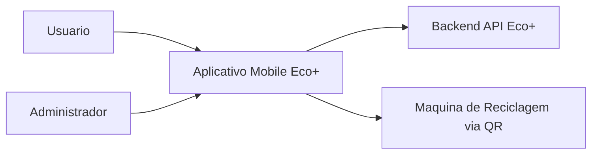
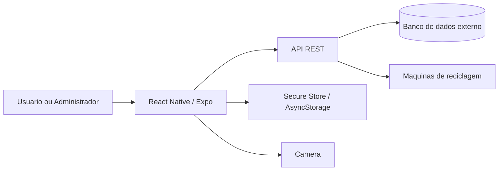
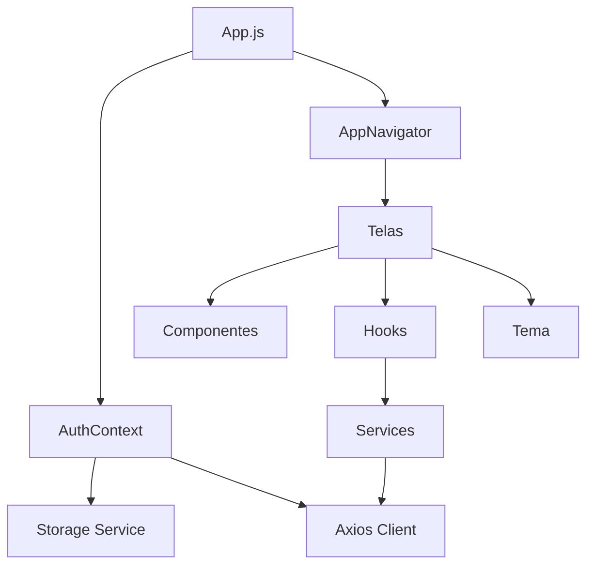

# Documentacao Tecnica do Frontend Eco+

## 1. Introducao

Este documento descreve o frontend mobile do Eco+, desenvolvido com React Native e Expo. A analise considera o codigo presente em `front-end-tcc` e concentra-se em arquitetura, telas, componentes, navegacao, autenticacao, API, estado, experiencia do usuario e melhorias.

O backend e citado apenas pelos contratos HTTP consumidos pelo aplicativo. Sua implementacao interna e banco de dados nao fazem parte do escopo.

## 2. Visao geral e objetivo

O Eco+ incentiva a reciclagem. O usuario cria uma conta, autentica-se, acompanha pontos e impacto ambiental, escaneia o QR Code de uma maquina, consulta descartes e acessa recompensas. Administradores tambem acompanham lixeiras e resolvem descartes sinalizados.

O ponto de entrada e `App.js`, que combina `NavigationContainer`, `AuthProvider`, barra de status e `AppNavigator`.

## 3. Tecnologias utilizadas

| Tecnologia | Uso confirmado |
|---|---|
| React 19 e React Native 0.81 | Componentes, telas e hooks |
| Expo SDK 54 | Execucao, configuracao e plugins |
| React Navigation 6 | Pilhas publica e autenticada |
| Axios | Cliente HTTP e interceptors |
| Expo Camera | Leitura de QR Code |
| Expo Secure Store | Armazenamento preferencial da sessao |
| AsyncStorage | Fallback de armazenamento |
| React Hook Form e Yup | Formulario e validacao do login |
| Expo Linear Gradient | Elementos visuais |
| Lucide React Native | Iconografia |
| Expo Clipboard | Copia de codigo de cupom |

Dependencias como `expo-image-picker`, `expo-auth-session` e `expo-crypto` devem ser auditadas para confirmar uso.

## 4. Estrutura de pastas

```text
front-end-tcc/
|-- App.js
|-- app.json
|-- package.json
|-- src/
|   |-- api/             # Cliente Axios
|   |-- components/      # Componentes reutilizaveis
|   |-- context/         # Estado global de autenticacao
|   |-- hooks/           # Estado e carregamento por dominio
|   |-- mocks/           # Conteudo ainda estatico
|   |-- navigation/      # Pilhas publica e autenticada
|   |-- screens/         # Telas
|   |-- services/        # HTTP e persistencia
|   |-- theme/           # Cores, espacamento e tipografia
|   |-- utils/           # JWT e perfil de acesso
|   `-- validation/      # Validacoes
|-- eco-frontend-doc-ai/ # Skill local
`-- DOCUMENTACAO_FRONTEND.md
```

A aplicacao foi consolidada em `src`, eliminando a antiga duplicacao de pastas na raiz.

## 5. Arquitetura frontend

A organizacao segue responsabilidades:

- **Apresentacao:** `src/screens` e `src/components`.
- **Navegacao:** `src/navigation`.
- **Estado global:** `src/context/AuthContext.js`.
- **Estado de dominio:** `src/hooks`.
- **Integracao:** `src/api/api.js` e `src/services`.
- **Persistencia:** `src/services/storageService.js`.
- **Tema:** `src/theme`.
- **Utilitarios:** `src/utils`.

Fluxo predominante:

```text
Tela -> Hook -> Service -> Axios -> Backend
```

## 6. Telas implementadas

| Tela | Arquivo | Finalidade | Situacao |
|---|---|---|---|
| Login | `src/screens/LoginScreen.js` | Autenticacao e redefinicao de senha | Confirmado |
| Cadastro | `src/screens/RegisterScreen.js` | Criacao de conta | Confirmado |
| Home | `src/screens/HomeScreen.js` | Pontos, impacto e resumo | Confirmado |
| Scanner | `src/screens/ScannerScreen.js` | Camera, QR manual e sessao | Confirmado |
| Historico | `src/screens/HistoryScreen.js` | Descartes, filtros e metricas | Confirmado |
| Recompensas | `src/screens/RewardsScreen.js` | Catalogo, saldo e cupom | Parcial/Mockado |
| Detalhes | `src/screens/RewardDetailsScreen.js` | Detalhes da recompensa | Parcial/Mockado |
| Cupons | `src/screens/CouponsScreen.js` | Listagem de cupons | Parcial/Mockado |
| Perfil | `src/screens/ProfileScreen.js` | Usuario, nivel e historico | Confirmado |
| Configuracoes | `src/screens/AccountSettingsScreen.js` | Edicao de perfil e senha | Parcial |
| Informacoes | `src/screens/AppInformationScreen.js` | Versao, stack e links | Parcial/Mockado |
| Suporte | `src/screens/SupportCenterScreen.js` | FAQ, contatos e formulario | Parcial/Mockado |
| Administracao | `src/screens/admin/AdminDashboardScreen.js` | Lixeiras e pendencias | Confirmado |

## 7. Componentes reutilizaveis

O projeto possui mais de quarenta componentes:

- Navegacao: `FloatingTabBar`, `Header`, `ScreenHeader`.
- Formularios: `InputField`, `TextInputField`, `PrimaryButton`, `GradientButton`.
- Feedback: `LoadingOverlay` e estados locais de erro/vazio.
- Home e historico: `Co2Card`, `StatCard`, `ActivityCard`, `HistoryProgressCard`.
- Scanner: `CameraScanner`, `ScannerOverlay`, `StatusBadge`, `WeeklyGoalCard`.
- Recompensas: `RewardCard`, `CouponCard`, `PointsBadge`, `RewardBanner`.
- Perfil e suporte: `ProfileCard`, `StatusCard`, `FAQAccordion`, `SupportCard`.
- Administracao: `AdminBinCard`, `FlaggedDiscardCard`, `ResolveDiscardModal`.

Os componentes compartilham tokens de `src/theme/colors.js` e `src/theme/spacing.js`.

## 8. Navegacao

`src/navigation/AppNavigator.js` decide entre:

- `AuthNavigator`: `Login` e `Register`.
- `AppStack`: onze rotas internas.

O acesso interno depende de `authenticated`, derivado do token no `AuthContext`. O painel administrativo possui verificacao adicional com `isAdminUser`; usuarios sem permissao sao redirecionados para `Home`.

O menu inferior e reutilizavel, mas cada tela repete a logica de destino. Centralizar essa configuracao reduziria divergencias.

## 9. Integracao com API

O Axios esta em `src/api/api.js`. A URL base vem de `expo.extra.apiBaseUrl`, configurada em `app.json` como `http://192.168.1.5:8000/v1`.

O interceptor de requisicao envia `Authorization: Bearer <token>`. Respostas `401` limpam o armazenamento e recebem a marca `isSessionExpired`.

| Metodo e rota | Service | Uso |
|---|---|---|
| `POST /auth/login` | `authService` | Login |
| `POST /auth/register` | `authService` | Cadastro |
| `POST /auth/reset-password` | `authService` | Redefinicao de senha |
| `GET /users/{id}` | `userService` | Dados do usuario |
| `PUT /users/{id}` | `userService` | Atualizacao de perfil |
| `GET /materials` | `materialService` | Materiais aceitos |
| `POST /sessions/start` | `sessionService` | Sessao por QR |
| `GET /discards/history` | `discardService` | Historico |
| `GET /rewards/history` | `rewardService` | Movimentacao de pontos |
| `POST /support/messages` | `supportService` | Suporte |
| `GET /admin/bins` | `adminService` | Lixeiras |
| `GET /admin/discards/flagged` | `adminService` | Pendencias |
| `POST /admin/discards/{id}/resolve` | `adminService` | Resolucao |

## 10. Autenticacao e sessao JWT

O fluxo centralizado em `src/context/AuthContext.js`:

1. Chama `authService.login`.
2. Normaliza o token retornado.
3. Obtem o usuario pela resposta ou payload JWT.
4. Persiste token e usuario.
5. Atualiza o header do Axios.
6. Restaura a sessao ao iniciar.
7. Limpa armazenamento, estado e header no logout.

`storageService` prioriza Secure Store e usa AsyncStorage como fallback. Nao foi localizado refresh token funcional. O logout no service tambem nao chama o backend.

## 11. Estado e hooks

O estado global e restrito a autenticacao. Os dominios usam hooks:

- `useUser`: usuario e sincronizacao com o contexto.
- `useDiscards`: historico, total e paginacao.
- `useRewards`: historico de recompensas.
- `useMaterials`: materiais ativos.
- `useSession`: inicio da sessao.
- `useScanner`: composicao do scanner e metricas.
- `useAdminBins`: lixeiras administrativas.
- `useFlaggedDiscards`: pendencias e resolucao.

Eles tratam loading, refresh, erro, repeticao de falha de rede e logout em `401`.

## 12. Fluxos principais

### Autenticacao

O login passa por validacao Yup, recebe JWT, persiste a sessao e libera a pilha autenticada.

### Scanner

O usuario le o QR Code ou informa o codigo manualmente. `useSession` envia `machine_qr` para `/sessions/start`. A tela apresenta maquina, materiais e metricas.

### Historico

Descartes, materiais, usuario e recompensas geram filtros, saldo, CO2 estimado e progresso mensal. A lista usa `FlatList`, paginacao e pull-to-refresh.

### Administracao

O administrador carrega lixeiras e descartes sinalizados e pode aprovar ou rejeitar com justificativa.

### Recompensas

O saldo usa dados reais, mas catalogo e codigos de cupom sao locais. O resgate nao e persistido no backend.

## 13. Regras de negocio refletidas

- Somente autenticados acessam rotas internas.
- O ID do usuario pode ser extraido do JWT.
- Administradores possuem painel protegido.
- Avatar usa iniciais do nome.
- Pontos determinam nivel e bloqueio de recompensas.
- QR vazio ou invalido nao inicia sessao.
- Historico aceita filtros por periodo e material.
- Pendencias administrativas podem ser aprovadas ou rejeitadas.

## 14. UI, UX e acessibilidade

Boas decisoes:

- `SafeAreaView` e `KeyboardAvoidingView`.
- `FlatList` no historico.
- Loading, erro, retry e empty state.
- Pull-to-refresh.
- Uso de `accessibilityRole` em varios controles.
- Largura maxima para telas maiores.
- Tema centralizado.

Melhorias necessarias:

- Padronizar textos em portugues.
- Corrigir caracteres com codificacao incorreta.
- Adicionar labels de acessibilidade ao menu inferior.
- Implementar links legais e notificacoes.
- Validar formato do e-mail no suporte.

## 15. Boas praticas observadas

- Estrutura unica em `src`.
- Separacao entre telas, hooks e services.
- Cliente HTTP unico.
- Token preferencialmente no Secure Store.
- Interceptors para autenticacao e `401`.
- Formularios com validacao e envio.
- Componentes reutilizaveis.
- Protecao administrativa.
- Paginacao e memoizacao.
- Bundle Android validado apos a reorganizacao.

## 16. Pontos de atencao

| Prioridade | Evidencia | Impacto |
|---|---|---|
| Alta | `rewardService.redeemReward` e local | Pontos podem divergir do backend |
| Alta | `userService.changePassword` retorna `null` | Senha nao e persistida |
| Alta | Refresh token ausente | Sessao expirada exige login |
| Media | Catalogo e cupons locais | Conteudo nao e administravel |
| Media | Mocks em Informacoes e Suporte | Dados podem ficar desatualizados |
| Media | IP fixo em `app.json` | Dificulta ambientes |
| Media | Codificacao inconsistente | Prejudica a interface |
| Media | Telas extensas | Aumenta manutencao |
| Baixa | Dependencias possivelmente ociosas | Aumenta complexidade |
| Baixa | Sem lint ou testes configurados | Reduz verificacao automatica |

## 17. Recomendacoes

1. Implementar resgate de recompensa no backend.
2. Implementar troca de senha ou ocultar o formulario.
3. Adotar refresh token e validar `exp` do JWT.
4. Substituir mocks por services ou configuracao unica.
5. Separar a URL da API por ambiente.
6. Padronizar arquivos em UTF-8 e textos em portugues.
7. Extrair calculos de telas extensas para hooks ou utilitarios.
8. Centralizar configuracao das abas.
9. Adicionar ESLint, Prettier e testes.
10. Auditar dependencias e permissoes nativas.

## 18. Diagramas C4

### Nivel 1 - Contexto



### Nivel 2 - Containers



### Nivel 3 - Componentes



## 19. Conclusao

O frontend Eco+ possui base funcional para autenticacao, scanner, historico, perfil e administracao. A consolidacao em `src`, a separacao entre hooks e services e o Axios unico tornam a arquitetura mais compreensivel.

O trabalho restante concentra-se na eliminacao de mocks, implementacao de endpoints incompletos, renovacao de sessao e verificacoes automatizadas. Essas melhorias deixarao o projeto mais preparado para apresentacao academica e uso real.

---

**Estado da analise:** codigo-fonte inspecionado e bundle Android validado. A API externa nao foi executada durante esta documentacao.
