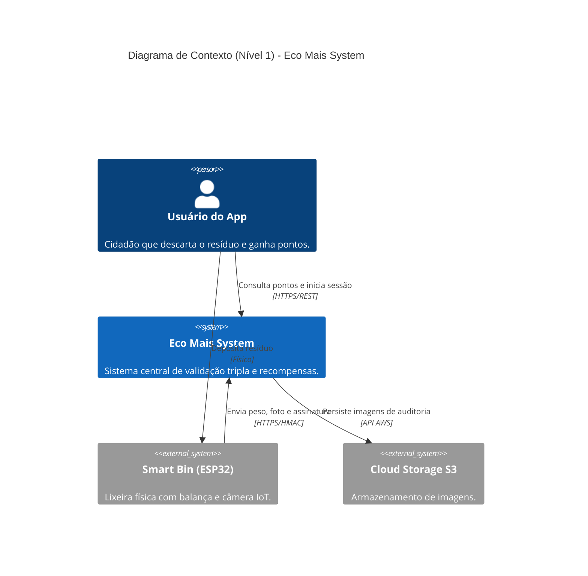
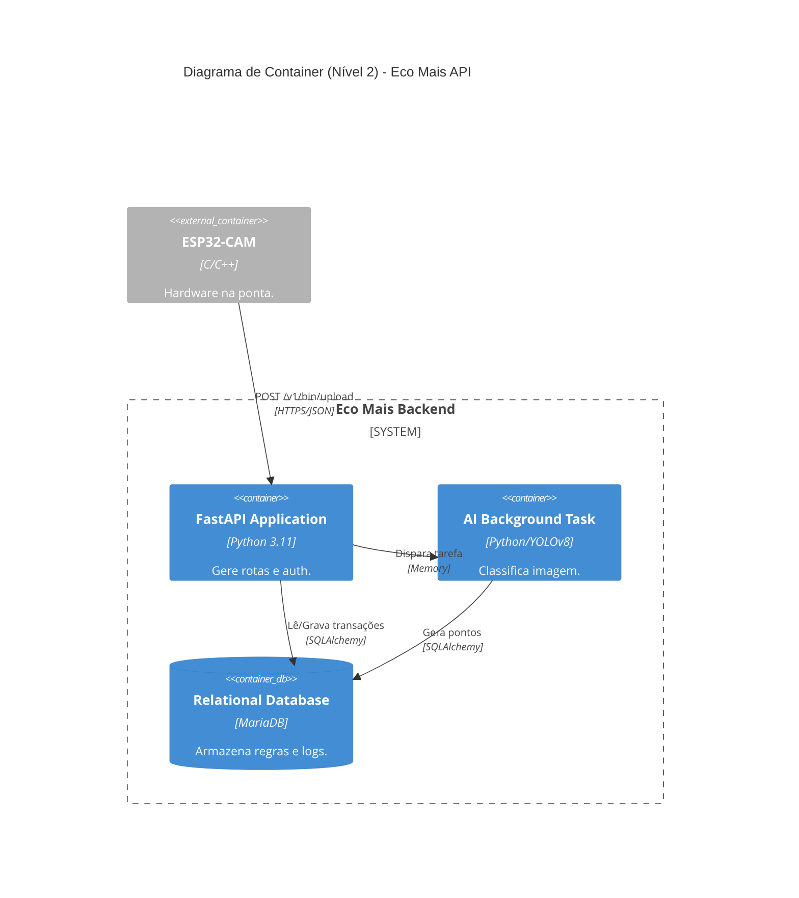

# 📄 Documentação Técnica Gerada pelo ProjectDoc AI

## 1. Visão geral do sistema

- **Objetivo do projeto:** Sistema inteligente de reciclagem (Green-Tech) focado em gamificação, que utiliza hardware IoT (Smart Bins) para recompensar usuários pelo descarte correto de resíduos, evitando fraudes através de uma rigorosa validação tripla (Sessão + Peso + Visão Computacional por IA).
- **Tecnologias utilizadas:** Python 3.11+, FastAPI, SQLAlchemy (ORM), MariaDB/MySQL, Ultralytics YOLOv8 (Visão Computacional), OpenCV, ESP32-CAM (C/C++), e Pydantic para gerenciamento seguro de ambiente.

## 2. Arquitetura e organização

- **Estrutura:** O projeto adota uma arquitetura em camadas altamente modular. O código é segmentado em diretórios de domínio: `api/` (roteamento e controllers), `services/` (regras de negócio e serviços isolados), `core/` (segurança e configuração), `ml/` (modelos de Inteligência Artificial) e base de dados via `models.py`.
- **Padrões identificados:** Padrão RESTful para API, Injeção de Dependência via FastAPI (`Depends()`), delegação assíncrona (FastAPI BackgroundTasks), e autenticação baseada em Handshake Criptográfico (HMAC-SHA256) para hardware.

## 3. Regras de negócio

- **Explícitas:**
  - Timeout de sessão de reciclagem fixado rigorosamente em 3 minutos.
  - Limites de validação de peso de segurança (mínimo de 10g e máximo de 10kg por item).
  - Rate Limiting de antifraude: limite de 10 descartes por sessão e 100 descartes diários por usuário.
- **Implícitas (Inferidas):**
  - A geração de pontos obedece um padrão atômico usando "Optimistic Locking" nas transações de banco de dados para evitar condição de corrida (_race conditions_).
  - Retorno HTTP 200 OK imediato ao ESP32-CAM (hardware) para não gerar travamento (timeout), enquanto a validação de IA ocorre assincronamente em background.

## 4. Fluxos principais

- **Fluxo de Autenticação IoT:** O ESP32 envia dados de descarte com cabeçalhos criptografados. O backend aplica HMAC-SHA256. Se a assinatura ou o timestamp falharem, a requisição é rejeitada (prevenção contra ataques de _replay_).
- **Pipeline de Validação Tripla:** O sistema valida a assinatura HMAC -> A sessão do usuário -> O peso da célula de carga -> Classificação por modelo YOLOv8. Se aprovado, computa pontos nas tabelas.

## 5. Boas práticas observadas

- Utilização de `hmac.compare_digest` para evitar ataques de temporização (_timing attacks_).
- Gestão de configurações centralizada via `Pydantic Settings` (`config.py`).
- Uso de `Enum` no banco de dados para garantir integridade referencial dos status.

## 6. Pontos de atenção e Inconsistências

- **Riscos de Escala (MVP):** O projeto utiliza `FastAPI BackgroundTasks` nativo. Pode estrangular a CPU do servidor em alta carga. Recomenda-se migrar para mensageria.
- **Gerenciamento de Imagens:** O armazenamento local (`./uploads/images`) não é escalável.
- **Ausência de Cache:** Consultas repetitivas batem diretamente no banco de dados.

## 7. Sugestão de diagramas C4 (Mermaid.js)

### Diagrama de Contexto (Nível 1)

### Diagrama de Container (Nível 2)

## 8. Recomendações técnicas

- **Fila de Mensageria:** Substituir o `BackgroundTasks` por um `Celery + Redis`.
- **Bucket de Objeto:** Migrar o armazenamento de imagens para a nuvem (S3).
- **Testes:** Ampliar a pasta `tests/` com testes unitários no `validation_service.py`.

## 9. Conclusão técnica da análise

O projeto `Eco_Mais` apresenta um nível de maturidade arquitetural muito superior ao esperado para projetos de TCC. As preocupações com autenticação baseada em hardware (IoT Security) e concorrência revelam aplicação de padrões consolidados na indústria.
